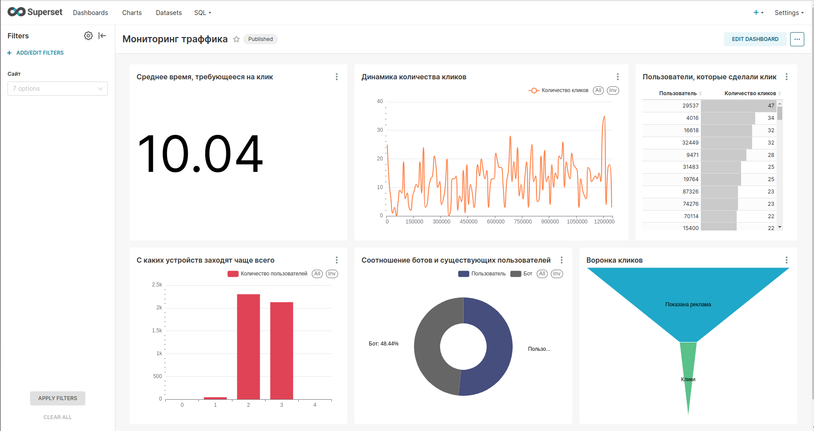

#  Анализ трафика пользователей

**Цель проекта:** По имеющемуся набору данных необходимо провести анализ трафика пользователей.

Этапы и выводы исследования представлены в jupyter notebook в соответствующей директории.

## Результаты

Реализовано два DAG'a для предобработки данных и их классификации.
Также построен дашборд для мониторинга траффика. 

Запустить проект можно командой:
    
    sh bin/start_project.sh

Дашборд со статистикой:

